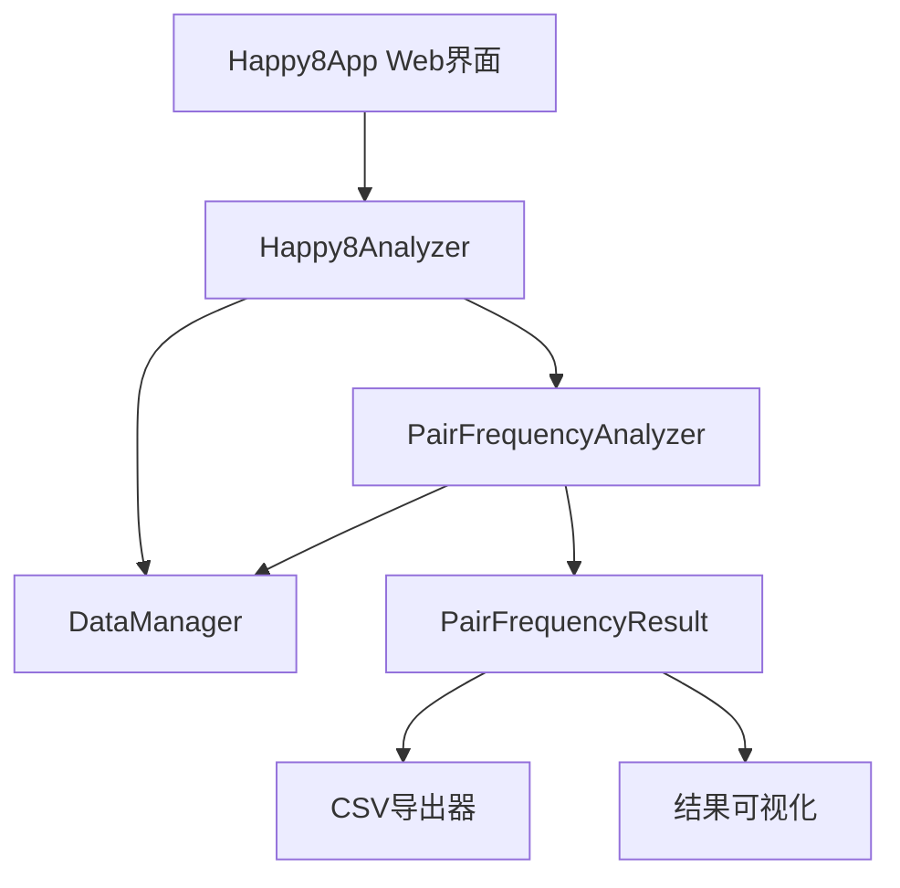

# 设计文档 - 数字对频率分析功能

## 概述

数字对频率分析功能将作为快乐8预测系统的一个新模块，集成到现有的 `Happy8Analyzer` 类中。该功能允许用户分析指定期号范围内两位数组合的出现频率，为预测提供统计学依据。

设计遵循现有系统的架构模式，使用面向对象的设计，确保代码的可维护性和扩展性。

## 架构

### 系统集成点

```
Happy8Analyzer (现有)
├── DataManager (现有)
├── PredictionEngine (现有) 
├── ComparisonEngine (现有)
└── PairFrequencyAnalyzer (新增) ← 新功能模块
```

### 模块关系



## 组件和接口

### 1. 核心分析器类 (PairFrequencyAnalyzer)

```python
class PairFrequencyAnalyzer:
    """数字对频率分析器"""
    
    def __init__(self, data_manager: DataManager):
        self.data_manager = data_manager
        self.cache = {}  # 结果缓存
    
    def analyze_pair_frequency(
        self, 
        target_issue: str, 
        period_count: int,
        use_cache: bool = True
    ) -> PairFrequencyResult:
        """分析数字对频率的主要方法"""
        pass
    
    def _calculate_issue_range(
        self, 
        target_issue: str, 
        period_count: int
    ) -> Tuple[str, str, int]:
        """计算实际的期号范围"""
        pass
    
    def _extract_number_pairs(
        self, 
        numbers: List[int]
    ) -> List[Tuple[int, int]]:
        """从一期的20个号码中提取所有两位数组合"""
        pass
    
    def _count_pair_frequencies(
        self, 
        data: pd.DataFrame
    ) -> Dict[Tuple[int, int], int]:
        """统计数字对出现频率"""
        pass
    
    def _sort_and_format_results(
        self, 
        pair_counts: Dict[Tuple[int, int], int],
        total_periods: int
    ) -> List[PairFrequencyItem]:
        """排序和格式化结果"""
        pass
```

### 2. 结果数据类

```python
@dataclass
class PairFrequencyItem:
    """单个数字对频率项"""
    pair: Tuple[int, int]
    count: int
    percentage: float
    
    def __str__(self) -> str:
        return f"({self.pair[0]:02d}, {self.pair[1]:02d}) - 出现 {self.count} 次 - 概率 {self.percentage:.1f}%"

@dataclass
class PairFrequencyResult:
    """数字对频率分析结果"""
    target_issue: str
    requested_periods: int
    actual_periods: int
    start_issue: str
    end_issue: str
    total_pairs: int
    frequency_items: List[PairFrequencyItem]
    analysis_time: datetime
    
    def to_dict(self) -> Dict[str, Any]:
        """转换为字典格式"""
        pass
    
    def to_dataframe(self) -> pd.DataFrame:
        """转换为DataFrame格式，便于导出"""
        pass
    
    def get_summary(self) -> Dict[str, Any]:
        """获取统计摘要"""
        pass
```

### 3. Web界面集成

在现有的 `happy8_app.py` 中添加新页面：

```python
def show_pair_frequency_analysis():
    """数字对频率分析页面"""
    st.header("🔢 数字对频率分析")
    
    # 输入参数
    col1, col2 = st.columns(2)
    with col1:
        target_issue = st.text_input("目标期号", value="2025091")
    with col2:
        period_count = st.number_input("统计期数", min_value=1, max_value=100, value=20)
    
    # 分析按钮和结果显示
    if st.button("开始分析"):
        # 调用分析器
        # 显示结果
        # 提供导出功能
        pass
```

## 数据模型

### 输入数据结构

```python
# 现有CSV数据格式 (data/happy8_results.csv)
{
    "issue": "2025091",           # 期号
    "date": "2025-08-19",        # 开奖日期  
    "num1": 9, "num2": 10, ...   # 20个开奖号码
}
```

### 处理数据结构

```python
# 数字对组合
pair_combinations = [
    (1, 2), (1, 3), ..., (79, 80)  # 从20个号码中选2个的所有组合
]

# 频率统计
pair_frequency_map = {
    (5, 15): 12,    # 数字对(5,15)出现12次
    (4, 18): 11,    # 数字对(4,18)出现11次
    ...
}
```

### 输出数据结构

```python
# 分析结果
{
    "target_issue": "2025091",
    "requested_periods": 20,
    "actual_periods": 20,
    "start_issue": "2025072", 
    "end_issue": "2025091",
    "total_pairs": 190,
    "frequency_items": [
        {
            "pair": (5, 15),
            "count": 12,
            "percentage": 60.0
        },
        ...
    ]
}
```

## 算法设计

### 1. 期号范围计算算法

```python
def calculate_issue_range(target_issue: str, period_count: int) -> Tuple[str, str, int]:
    """
    算法：从目标期号向前计算指定期数的范围
    
    输入：target_issue="2025091", period_count=20
    处理：
    1. 解析期号格式 (年份+期数)
    2. 计算起始期号 = target_issue - (period_count - 1)
    3. 验证期号是否存在于历史数据中
    4. 返回实际可用的期号范围
    
    输出：("2025072", "2025091", 20)
    """
```

### 2. 数字对提取算法

```python
def extract_number_pairs(numbers: List[int]) -> List[Tuple[int, int]]:
    """
    算法：从20个开奖号码中提取所有两位数组合
    
    输入：[9, 10, 13, 14, 22, 30, 32, 34, 36, 38, 43, 49, 50, 54, 56, 57, 58, 68, 69, 76]
    处理：使用组合数学 C(20,2) = 190种组合
    
    伪代码：
    pairs = []
    for i in range(len(numbers)):
        for j in range(i+1, len(numbers)):
            pairs.append((min(numbers[i], numbers[j]), max(numbers[i], numbers[j])))
    return pairs
    
    输出：[(9, 10), (9, 13), (9, 14), ..., (69, 76)]
    """
```

### 3. 频率统计算法

```python
def count_pair_frequencies(data: pd.DataFrame) -> Dict[Tuple[int, int], int]:
    """
    算法：统计多期数据中数字对的出现频率
    
    时间复杂度：O(n * 190) 其中n为期数，190为每期的数字对数量
    空间复杂度：O(k) 其中k为不同数字对的数量
    
    优化策略：
    1. 使用字典计数器提高查找效率
    2. 并行处理多期数据
    3. 结果缓存避免重复计算
    """
```

## 错误处理

### 1. 输入验证

```python
class ValidationError(Exception):
    """输入验证错误"""
    pass

def validate_inputs(target_issue: str, period_count: int):
    """
    验证输入参数的有效性
    
    检查项：
    1. 期号格式是否正确 (YYYYNNN)
    2. 期数是否在合理范围内 (1-100)
    3. 期号是否存在于历史数据中
    """
```

### 2. 数据异常处理

```python
def handle_data_exceptions():
    """
    处理数据相关异常
    
    异常类型：
    1. 数据文件不存在
    2. 数据格式错误
    3. 期号不连续
    4. 开奖号码数量不足20个
    """
```

### 3. 性能异常处理

```python
def handle_performance_issues():
    """
    处理性能相关问题
    
    策略：
    1. 超时控制 (最大30秒)
    2. 内存使用监控
    3. 大数据量分批处理
    4. 进度提示和取消功能
    """
```

## 测试策略

### 1. 单元测试

```python
class TestPairFrequencyAnalyzer(unittest.TestCase):
    """数字对频率分析器单元测试"""
    
    def test_extract_number_pairs(self):
        """测试数字对提取功能"""
        numbers = [1, 2, 3, 4, 5]
        expected = [(1,2), (1,3), (1,4), (1,5), (2,3), (2,4), (2,5), (3,4), (3,5), (4,5)]
        result = extract_number_pairs(numbers)
        self.assertEqual(result, expected)
    
    def test_calculate_issue_range(self):
        """测试期号范围计算"""
        pass
    
    def test_frequency_calculation(self):
        """测试频率计算准确性"""
        pass
```

### 2. 集成测试

```python
def test_end_to_end_analysis():
    """端到端测试"""
    # 使用真实数据测试完整流程
    analyzer = PairFrequencyAnalyzer(data_manager)
    result = analyzer.analyze_pair_frequency("2025091", 20)
    
    # 验证结果格式和数据完整性
    assert result.actual_periods > 0
    assert len(result.frequency_items) > 0
    assert all(item.count > 0 for item in result.frequency_items)
```

### 3. 性能测试

```python
def test_performance():
    """性能测试"""
    import time
    
    start_time = time.time()
    result = analyzer.analyze_pair_frequency("2025091", 100)  # 大数据量测试
    end_time = time.time()
    
    # 验证性能要求
    assert end_time - start_time < 10  # 10秒内完成
    assert len(result.frequency_items) > 0
```

## 性能优化

### 1. 缓存策略

```python
class ResultCache:
    """结果缓存管理器"""
    
    def __init__(self, max_size: int = 100):
        self.cache = {}
        self.max_size = max_size
    
    def get_cache_key(self, target_issue: str, period_count: int) -> str:
        return f"{target_issue}_{period_count}"
    
    def get(self, key: str) -> Optional[PairFrequencyResult]:
        """获取缓存结果"""
        pass
    
    def set(self, key: str, result: PairFrequencyResult):
        """设置缓存结果"""
        pass
```

### 2. 并行处理

```python
def parallel_pair_extraction(data_chunks: List[pd.DataFrame]) -> List[Dict]:
    """并行处理数字对提取"""
    with ThreadPoolExecutor(max_workers=4) as executor:
        futures = [executor.submit(process_chunk, chunk) for chunk in data_chunks]
        results = [future.result() for future in futures]
    return results
```

### 3. 内存优化

```python
def memory_efficient_processing(data: pd.DataFrame) -> Dict:
    """内存高效的处理方式"""
    # 分批处理大数据集
    # 及时释放不需要的数据
    # 使用生成器减少内存占用
    pass
```

## 部署考虑

### 1. 配置管理

```python
# 在 deployment/production_config.py 中添加
PAIR_FREQUENCY_CONFIG = {
    "max_periods": 100,
    "cache_size": 100,
    "timeout_seconds": 30,
    "enable_parallel": True,
    "max_workers": 4
}
```

### 2. 监控和日志

```python
import logging

logger = logging.getLogger("pair_frequency_analyzer")

def log_analysis_request(target_issue: str, period_count: int):
    """记录分析请求"""
    logger.info(f"分析请求: 期号={target_issue}, 期数={period_count}")

def log_performance_metrics(execution_time: float, data_size: int):
    """记录性能指标"""
    logger.info(f"执行时间: {execution_time:.2f}s, 数据量: {data_size}")
```

### 3. 扩展性设计

```python
class PairFrequencyAnalyzer:
    """支持未来扩展的设计"""
    
    def __init__(self, data_manager: DataManager, config: Dict = None):
        self.data_manager = data_manager
        self.config = config or {}
        self.plugins = []  # 支持插件扩展
    
    def register_plugin(self, plugin):
        """注册分析插件"""
        self.plugins.append(plugin)
    
    def analyze_with_plugins(self, *args, **kwargs):
        """支持插件的分析方法"""
        # 基础分析 + 插件增强
        pass
```

---

该设计文档提供了完整的技术架构和实现方案，确保新功能能够无缝集成到现有系统中，同时保持良好的性能和可维护性。