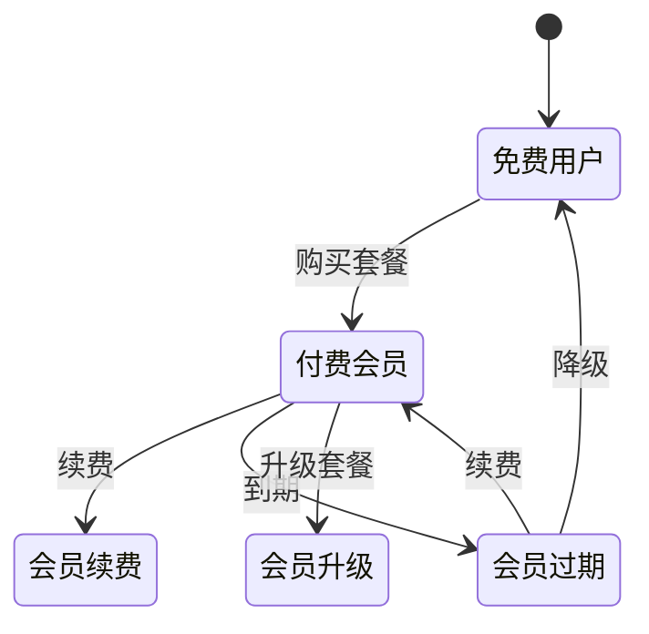

# 用户会员体系设计文档（精简版）

## 一、文档概述

### 1.1 文档目的
本文档提供一套精简高效的用户会员体系设计方案，专注于核心的用户管理和会员权益体系，去除了积分、成长值等复杂机制，适合快速开发和迭代。

### 1.2 设计理念
- **简洁至上**：只保留核心功能，降低系统复杂度
- **快速集成**：标准化接口设计，便于各技术栈实现
- **安全可靠**：完善的认证授权和数据保护机制
- **灵活扩展**：模块化设计，便于后续功能添加

### 1.3 适用场景
- SaaS应用的订阅制服务
- 内容平台的付费会员
- 工具类应用的功能解锁
- 小程序的轻量级会员体系

## 二、核心架构设计

### 2.1 系统架构

```
┌─────────────────────────────────────────┐
│             客户端层                      │
│   Web / App / 小程序 / API               │
├─────────────────────────────────────────┤
│             网关层                       │
│   认证 / 限流 / 路由                     │
├─────────────────────────────────────────┤
│             业务层                       │
│   用户服务 / 会员服务 / 支付服务          │
├─────────────────────────────────────────┤
│             数据层                       │
│   MySQL / Redis / OSS                   │
└─────────────────────────────────────────┘
```

### 2.2 核心模块

#### 2.2.1 用户模块
- 多渠道注册登录（手机/邮箱/第三方OAuth）
- 用户信息管理
- 认证授权（JWT双令牌机制）
- 用户状态管理

#### 2.2.2 会员模块
- 会员等级管理（免费/基础/高级/企业）
- 会员权益配置
- 会员订阅管理
- 权限控制体系

#### 2.2.3 支付模块
- 多支付渠道集成
- 订单生命周期管理
- 支付回调处理
- 退款管理

## 三、数据库设计（MySQL）

### 3.1 用户核心表

```sql
-- 用户主表
CREATE TABLE `users` (
  `id` BIGINT UNSIGNED NOT NULL AUTO_INCREMENT COMMENT '用户ID',
  `username` VARCHAR(50) UNIQUE COMMENT '用户名',
  `email` VARCHAR(100) UNIQUE COMMENT '邮箱',
  `phone` VARCHAR(20) UNIQUE COMMENT '手机号',
  `password_hash` VARCHAR(255) COMMENT '密码哈希',
  `status` TINYINT DEFAULT 1 COMMENT '状态：0-禁用 1-正常 2-冻结',
  `register_source` VARCHAR(20) COMMENT '注册来源',
  `last_login_at` DATETIME COMMENT '最后登录时间',
  `created_at` DATETIME DEFAULT CURRENT_TIMESTAMP,
  `updated_at` DATETIME DEFAULT CURRENT_TIMESTAMP ON UPDATE CURRENT_TIMESTAMP,
  PRIMARY KEY (`id`),
  KEY `idx_email` (`email`),
  KEY `idx_phone` (`phone`),
  KEY `idx_status` (`status`)
) ENGINE=InnoDB DEFAULT CHARSET=utf8mb4 COMMENT='用户基础表';

-- 用户详情表
CREATE TABLE `user_profiles` (
  `id` BIGINT UNSIGNED NOT NULL AUTO_INCREMENT,
  `user_id` BIGINT UNSIGNED NOT NULL UNIQUE COMMENT '用户ID',
  `nickname` VARCHAR(50) COMMENT '昵称',
  `avatar` VARCHAR(500) COMMENT '头像URL',
  `real_name` VARCHAR(50) COMMENT '真实姓名',
  `id_card_encrypted` VARCHAR(255) COMMENT '身份证号(加密)',
  `gender` TINYINT COMMENT '性别：0-未知 1-男 2-女',
  `birthday` DATE COMMENT '生日',
  `address` TEXT COMMENT '地址',
  `preferences` JSON COMMENT '用户偏好设置',
  `created_at` DATETIME DEFAULT CURRENT_TIMESTAMP,
  `updated_at` DATETIME DEFAULT CURRENT_TIMESTAMP ON UPDATE CURRENT_TIMESTAMP,
  PRIMARY KEY (`id`),
  CONSTRAINT `fk_profile_user` FOREIGN KEY (`user_id`) REFERENCES `users` (`id`) ON DELETE CASCADE
) ENGINE=InnoDB DEFAULT CHARSET=utf8mb4 COMMENT='用户详情表';

-- 第三方账号绑定表
CREATE TABLE `user_oauth` (
  `id` BIGINT UNSIGNED NOT NULL AUTO_INCREMENT,
  `user_id` BIGINT UNSIGNED NOT NULL COMMENT '用户ID',
  `provider` VARCHAR(20) NOT NULL COMMENT '平台：wechat/alipay/google/apple',
  `openid` VARCHAR(128) NOT NULL COMMENT '第三方用户标识',
  `unionid` VARCHAR(128) COMMENT '第三方联合ID',
  `access_token` TEXT COMMENT '访问令牌(加密存储)',
  `refresh_token` TEXT COMMENT '刷新令牌(加密存储)',
  `expires_at` DATETIME COMMENT '过期时间',
  `created_at` DATETIME DEFAULT CURRENT_TIMESTAMP,
  PRIMARY KEY (`id`),
  UNIQUE KEY `uk_provider_openid` (`provider`, `openid`),
  KEY `idx_user_id` (`user_id`),
  CONSTRAINT `fk_oauth_user` FOREIGN KEY (`user_id`) REFERENCES `users` (`id`) ON DELETE CASCADE
) ENGINE=InnoDB DEFAULT CHARSET=utf8mb4 COMMENT='第三方账号绑定表';
```

### 3.2 会员体系表

```sql
-- 会员等级配置表
CREATE TABLE `membership_levels` (
  `id` INT UNSIGNED NOT NULL AUTO_INCREMENT,
  `level_code` VARCHAR(20) NOT NULL UNIQUE COMMENT '等级代码',
  `level_name` VARCHAR(50) NOT NULL COMMENT '等级名称',
  `level_value` INT NOT NULL COMMENT '等级权重(用于比较)',
  `icon_url` VARCHAR(500) COMMENT '等级图标',
  `color_code` VARCHAR(20) COMMENT '等级颜色',
  `benefits` JSON COMMENT '权益配置JSON',
  `is_purchasable` BOOLEAN DEFAULT FALSE COMMENT '是否可购买',
  `sort_order` INT DEFAULT 0 COMMENT '排序',
  `status` TINYINT DEFAULT 1 COMMENT '状态',
  `created_at` DATETIME DEFAULT CURRENT_TIMESTAMP,
  PRIMARY KEY (`id`),
  KEY `idx_level_code` (`level_code`),
  KEY `idx_level_value` (`level_value`)
) ENGINE=InnoDB DEFAULT CHARSET=utf8mb4 COMMENT='会员等级配置表';

-- 用户会员信息表
CREATE TABLE `user_memberships` (
  `id` BIGINT UNSIGNED NOT NULL AUTO_INCREMENT,
  `user_id` BIGINT UNSIGNED NOT NULL UNIQUE COMMENT '用户ID',
  `level_id` INT UNSIGNED NOT NULL COMMENT '会员等级ID',
  `membership_no` VARCHAR(32) UNIQUE COMMENT '会员号',
  `expire_date` DATETIME COMMENT '到期时间',
  `is_auto_renew` BOOLEAN DEFAULT FALSE COMMENT '自动续费',
  `last_payment_date` DATETIME COMMENT '上次支付时间',
  `total_payment_amount` DECIMAL(10,2) DEFAULT 0 COMMENT '累计支付金额',
  `created_at` DATETIME DEFAULT CURRENT_TIMESTAMP,
  `updated_at` DATETIME DEFAULT CURRENT_TIMESTAMP ON UPDATE CURRENT_TIMESTAMP,
  PRIMARY KEY (`id`),
  CONSTRAINT `fk_membership_user` FOREIGN KEY (`user_id`) REFERENCES `users` (`id`) ON DELETE CASCADE,
  CONSTRAINT `fk_membership_level` FOREIGN KEY (`level_id`) REFERENCES `membership_levels` (`id`)
) ENGINE=InnoDB DEFAULT CHARSET=utf8mb4 COMMENT='用户会员信息表';

-- 会员套餐表
CREATE TABLE `membership_plans` (
  `id` INT UNSIGNED NOT NULL AUTO_INCREMENT,
  `plan_code` VARCHAR(50) UNIQUE NOT NULL COMMENT '套餐代码',
  `plan_name` VARCHAR(100) NOT NULL COMMENT '套餐名称',
  `level_id` INT UNSIGNED NOT NULL COMMENT '对应等级',
  `duration_type` ENUM('day','month','year','lifetime') COMMENT '时长类型',
  `duration_value` INT NOT NULL COMMENT '时长值',
  `price` DECIMAL(10,2) NOT NULL COMMENT '价格',
  `original_price` DECIMAL(10,2) COMMENT '原价',
  `features` JSON COMMENT '套餐特性',
  `limitations` JSON COMMENT '限制条件',
  `is_recommended` BOOLEAN DEFAULT FALSE COMMENT '是否推荐',
  `status` TINYINT DEFAULT 1 COMMENT '状态',
  `created_at` DATETIME DEFAULT CURRENT_TIMESTAMP,
  PRIMARY KEY (`id`),
  KEY `idx_level_id` (`level_id`),
  CONSTRAINT `fk_plan_level` FOREIGN KEY (`level_id`) REFERENCES `membership_levels` (`id`)
) ENGINE=InnoDB DEFAULT CHARSET=utf8mb4 COMMENT='会员套餐表';

-- 会员订单表
CREATE TABLE `membership_orders` (
  `id` BIGINT UNSIGNED NOT NULL AUTO_INCREMENT,
  `order_no` VARCHAR(64) UNIQUE NOT NULL COMMENT '订单号',
  `user_id` BIGINT UNSIGNED NOT NULL COMMENT '用户ID',
  `plan_id` INT UNSIGNED NOT NULL COMMENT '套餐ID',
  `amount` DECIMAL(10,2) NOT NULL COMMENT '订单金额',
  `payment_method` VARCHAR(50) COMMENT '支付方式',
  `payment_no` VARCHAR(100) COMMENT '第三方支付流水号',
  `status` ENUM('pending','paid','cancelled','refunded','expired') DEFAULT 'pending',
  `paid_at` DATETIME COMMENT '支付时间',
  `expire_at` DATETIME COMMENT '订单过期时间',
  `created_at` DATETIME DEFAULT CURRENT_TIMESTAMP,
  `updated_at` DATETIME DEFAULT CURRENT_TIMESTAMP ON UPDATE CURRENT_TIMESTAMP,
  PRIMARY KEY (`id`),
  UNIQUE KEY `uk_order_no` (`order_no`),
  KEY `idx_user_id` (`user_id`),
  KEY `idx_status` (`status`),
  CONSTRAINT `fk_order_user` FOREIGN KEY (`user_id`) REFERENCES `users` (`id`) ON DELETE CASCADE
) ENGINE=InnoDB DEFAULT CHARSET=utf8mb4 COMMENT='会员订单表';
```

### 3.3 权限控制表

```sql
-- 功能权限表
CREATE TABLE `permissions` (
  `id` INT UNSIGNED NOT NULL AUTO_INCREMENT,
  `code` VARCHAR(100) UNIQUE NOT NULL COMMENT '权限代码',
  `name` VARCHAR(100) NOT NULL COMMENT '权限名称',
  `category` VARCHAR(50) COMMENT '权限分类',
  `description` TEXT COMMENT '描述',
  `created_at` DATETIME DEFAULT CURRENT_TIMESTAMP,
  PRIMARY KEY (`id`),
  KEY `idx_code` (`code`),
  KEY `idx_category` (`category`)
) ENGINE=InnoDB DEFAULT CHARSET=utf8mb4 COMMENT='功能权限表';

-- 会员等级权限关联表
CREATE TABLE `level_permissions` (
  `id` BIGINT UNSIGNED NOT NULL AUTO_INCREMENT,
  `level_id` INT UNSIGNED NOT NULL,
  `permission_id` INT UNSIGNED NOT NULL,
  `quota` INT COMMENT '配额限制(如每日次数)',
  `config` JSON COMMENT '权限配置',
  PRIMARY KEY (`id`),
  UNIQUE KEY `uk_level_permission` (`level_id`, `permission_id`),
  CONSTRAINT `fk_lp_level` FOREIGN KEY (`level_id`) REFERENCES `membership_levels` (`id`) ON DELETE CASCADE,
  CONSTRAINT `fk_lp_permission` FOREIGN KEY (`permission_id`) REFERENCES `permissions` (`id`) ON DELETE CASCADE
) ENGINE=InnoDB DEFAULT CHARSET=utf8mb4 COMMENT='会员等级权限关联表';

-- 用户权限使用记录表
CREATE TABLE `user_permission_logs` (
  `id` BIGINT UNSIGNED NOT NULL AUTO_INCREMENT,
  `user_id` BIGINT UNSIGNED NOT NULL,
  `permission_id` INT UNSIGNED NOT NULL,
  `use_date` DATE NOT NULL COMMENT '使用日期',
  `use_count` INT DEFAULT 1 COMMENT '使用次数',
  `metadata` JSON COMMENT '元数据',
  `created_at` DATETIME DEFAULT CURRENT_TIMESTAMP,
  PRIMARY KEY (`id`),
  KEY `idx_user_date` (`user_id`, `use_date`),
  KEY `idx_permission` (`permission_id`),
  CONSTRAINT `fk_upl_user` FOREIGN KEY (`user_id`) REFERENCES `users` (`id`) ON DELETE CASCADE
) ENGINE=InnoDB DEFAULT CHARSET=utf8mb4 COMMENT='用户权限使用记录表';
```

### 3.4 系统支撑表

```sql
-- 登录日志表
CREATE TABLE `login_logs` (
  `id` BIGINT UNSIGNED NOT NULL AUTO_INCREMENT,
  `user_id` BIGINT UNSIGNED COMMENT '用户ID',
  `login_type` VARCHAR(20) COMMENT '登录方式',
  `ip_address` VARCHAR(45) COMMENT 'IP地址',
  `user_agent` TEXT COMMENT '用户代理',
  `device_id` VARCHAR(128) COMMENT '设备ID',
  `status` TINYINT COMMENT '状态：0-失败 1-成功',
  `failure_reason` VARCHAR(255) COMMENT '失败原因',
  `created_at` DATETIME DEFAULT CURRENT_TIMESTAMP,
  PRIMARY KEY (`id`),
  KEY `idx_user_id` (`user_id`),
  KEY `idx_created_at` (`created_at`)
) ENGINE=InnoDB DEFAULT CHARSET=utf8mb4 COMMENT='登录日志表';

-- 操作审计表
CREATE TABLE `audit_logs` (
  `id` BIGINT UNSIGNED NOT NULL AUTO_INCREMENT,
  `user_id` BIGINT UNSIGNED COMMENT '用户ID',
  `operation` VARCHAR(100) NOT NULL COMMENT '操作类型',
  `resource_type` VARCHAR(50) COMMENT '资源类型',
  `resource_id` VARCHAR(100) COMMENT '资源ID',
  `changes` JSON COMMENT '变更内容',
  `ip_address` VARCHAR(45) COMMENT 'IP地址',
  `created_at` DATETIME DEFAULT CURRENT_TIMESTAMP,
  PRIMARY KEY (`id`),
  KEY `idx_user_id` (`user_id`),
  KEY `idx_operation` (`operation`),
  KEY `idx_created_at` (`created_at`)
) ENGINE=InnoDB DEFAULT CHARSET=utf8mb4 COMMENT='操作审计表';
```

## 四、核心功能设计

### 4.1 用户认证体系

#### 4.1.1 多渠道登录

##### 手机号/邮箱登录
```yaml
流程:
  1. 发送验证码
  2. 验证码校验
  3. 账号存在检查
  4. 生成Token
  5. 返回用户信息
```

##### 第三方OAuth登录
```yaml
流程:
  1. 获取授权码
  2. 换取Access Token
  3. 获取用户信息
  4. 账号绑定/创建
  5. 生成系统Token
```

#### 4.1.2 JWT双令牌机制

```javascript
// Token设计
{
  "access_token": {
    "type": "access",
    "expires": "30分钟",
    "payload": {
      "user_id": "用户ID",
      "level": "会员等级",
      "permissions": ["权限列表"]
    }
  },
  "refresh_token": {
    "type": "refresh",
    "expires": "30天",
    "payload": {
      "user_id": "用户ID",
      "device_id": "设备ID"
    }
  }
}
```

#### 4.1.3 Token管理策略

- **自动续期**：Access Token即将过期时自动使用Refresh Token续期
- **黑名单机制**：登出或异常Token加入黑名单
- **多设备管理**：支持同账号多设备登录
- **强制下线**：支持踢出指定设备

### 4.2 会员体系设计

#### 4.2.1 会员等级架构

```yaml
免费用户 (FREE):
  - 基础功能
  - 有限配额
  - 广告展示

基础会员 (BASIC):
  - 去除广告
  - 增加配额
  - 基础特权

高级会员 (PREMIUM):
  - 全部功能
  - 无限配额
  - 高级特权
  - 优先支持

企业会员 (ENTERPRISE):
  - 定制功能
  - 专属服务
  - API接入
  - SLA保障
```

#### 4.2.2 权益配置系统

```json
{
  "level": "PREMIUM",
  "benefits": {
    "features": {
      "advanced_analysis": true,
      "export_data": true,
      "api_access": true,
      "priority_support": true
    },
    "quotas": {
      "storage_gb": 100,
      "api_calls_per_day": 10000,
      "team_members": 10
    },
    "ui": {
      "remove_ads": true,
      "custom_theme": true,
      "badge_display": "premium"
    }
  }
}
```

#### 4.2.3 会员生命周期管理



### 4.3 支付与订单

#### 4.3.1 支付流程

```yaml
订单创建:
  - 选择套餐
  - 计算价格
  - 应用优惠
  - 生成订单号

支付处理:
  - 调用支付接口
  - 返回支付参数
  - 前端唤起支付
  - 等待回调

回调处理:
  - 验证签名
  - 幂等性检查
  - 更新订单状态
  - 开通会员权益
  - 发送通知
```

#### 4.3.2 订单状态机

```
pending(待支付) ──> paid(已支付) ──> completed(已完成)
     │                  │
     ├──> expired       └──> refunded(已退款)
     │    (已过期)
     └──> cancelled(已取消)
```

### 4.4 权限控制

#### 4.4.1 基于会员等级的权限模型

```python
# 权限检查逻辑
def check_permission(user, resource, action):
    # 1. 获取用户会员等级
    user_level = get_user_membership_level(user.id)

    # 2. 获取资源所需权限
    required_permission = get_resource_permission(resource, action)

    # 3. 检查等级权限
    level_permissions = get_level_permissions(user_level)

    # 4. 验证权限
    if required_permission in level_permissions:
        # 5. 检查配额限制
        return check_quota_limit(user.id, required_permission)

    return False
```

#### 4.4.2 配额管理

```yaml
配额类型:
  - 每日配额: 24小时重置
  - 每月配额: 自然月重置
  - 总量配额: 不重置
  - 并发配额: 实时检查

配额策略:
  - 软限制: 超出后降级服务
  - 硬限制: 超出后拒绝服务
  - 弹性限制: 临时提升配额
```

## 五、API接口设计

### 5.1 用户相关接口

```yaml
# 用户注册
POST /api/v1/auth/register
Body:
  email: string
  password: string
  captcha: string

# 用户登录
POST /api/v1/auth/login
Body:
  account: string  # 邮箱/手机号/用户名
  password: string

# 第三方登录
POST /api/v1/auth/oauth/{provider}
Body:
  code: string
  state: string

# 刷新Token
POST /api/v1/auth/refresh
Body:
  refresh_token: string

# 获取用户信息
GET /api/v1/users/me
Headers:
  Authorization: Bearer {token}

# 更新用户资料
PUT /api/v1/users/profile
Body:
  nickname: string
  avatar: string
  ...
```

### 5.2 会员相关接口

```yaml
# 获取会员状态
GET /api/v1/membership/status

# 获取套餐列表
GET /api/v1/membership/plans

# 创建订单
POST /api/v1/membership/orders
Body:
  plan_id: integer
  payment_method: string

# 查询订单
GET /api/v1/membership/orders/{order_no}

# 支付回调
POST /api/v1/payment/notify/{provider}

# 检查权限
GET /api/v1/membership/permissions
Query:
  resource: string
  action: string
```

## 六、安全机制

### 6.1 认证安全

- **密码安全**：BCrypt/Argon2加密，独立盐值
- **Token安全**：HTTPS传输，定期轮换
- **多因素认证**：短信/TOTP/生物识别
- **设备管理**：设备指纹，异常检测

### 6.2 数据安全

- **敏感数据加密**：AES-256加密存储
- **传输加密**：TLS 1.3
- **数据脱敏**：日志和接口返回脱敏
- **备份恢复**：定期备份，异地容灾

### 6.3 访问控制

- **限流策略**：令牌桶/滑动窗口
- **防重放**：请求签名+时间戳
- **IP黑白名单**：动态IP管理
- **异常检测**：行为分析，风险评分

## 七、性能优化

### 7.1 缓存策略

```yaml
Redis缓存:
  用户信息:
    key: user:{user_id}
    ttl: 1800s

  会员状态:
    key: membership:{user_id}
    ttl: 600s

  套餐信息:
    key: plans:all
    ttl: 3600s

  权限配置:
    key: permissions:{level}
    ttl: 3600s

本地缓存:
  - 热点数据
  - 配置信息
  - 静态资源
```

### 7.2 查询优化

- **索引优化**：合理建立索引
- **查询优化**：避免N+1问题
- **分页处理**：游标分页
- **批量操作**：减少数据库交互

### 7.3 异步处理

- **消息队列**：订单处理、通知发送
- **定时任务**：会员过期检查、数据统计
- **事件驱动**：解耦业务逻辑

## 八、监控运维

### 8.1 监控指标

```yaml
系统指标:
  - CPU/内存/磁盘使用率
  - 网络流量
  - 数据库连接数

业务指标:
  - 用户注册/登录量
  - 会员转化率
  - 订单成功率
  - API响应时间

安全指标:
  - 异常登录检测
  - 攻击拦截统计
  - 敏感操作审计
```

### 8.2 日志体系

```yaml
日志分类:
  - 访问日志: Nginx/Gateway
  - 应用日志: 业务逻辑
  - 错误日志: 异常追踪
  - 审计日志: 操作记录
  - 安全日志: 安全事件

日志级别:
  - ERROR: 错误信息
  - WARN: 警告信息
  - INFO: 重要信息
  - DEBUG: 调试信息
```

## 九、部署方案

### 9.1 容器化部署

```yaml
Docker Compose:
  services:
    app:
      image: app:latest
      replicas: 3

    mysql:
      image: mysql:8.0
      volumes:
        - mysql_data:/var/lib/mysql

    redis:
      image: redis:7.0
      volumes:
        - redis_data:/data

    nginx:
      image: nginx:alpine
      volumes:
        - nginx_conf:/etc/nginx
```

### 9.2 高可用架构

```
                    ┌─────────────┐
                    │   CDN/WAF   │
                    └─────────────┘
                           │
                    ┌─────────────┐
                    │     LB      │
                    └─────────────┘
                      /    |    \
              ┌──────┐ ┌──────┐ ┌──────┐
              │ APP1 │ │ APP2 │ │ APP3 │
              └──────┘ └──────┘ └──────┘
                      \    |    /
                ┌──────────────────┐
                │  Redis Cluster   │
                └──────────────────┘
                ┌──────────────────┐
                │  MySQL Master    │
                └──────────────────┘
                      /        \
            ┌──────────┐    ┌──────────┐
            │  Slave1  │    │  Slave2  │
            └──────────┘    └──────────┘
```

## 十、实施指南

### 10.1 开发流程

```yaml
Phase 1 - 基础搭建 (1-2周):
  - 数据库设计
  - 基础框架搭建
  - 用户注册登录

Phase 2 - 会员体系 (2-3周):
  - 会员等级配置
  - 套餐管理
  - 权限控制

Phase 3 - 支付集成 (1-2周):
  - 支付接口对接
  - 订单管理
  - 回调处理

Phase 4 - 优化完善 (1-2周):
  - 性能优化
  - 安全加固
  - 测试部署
```

### 10.2 技术选型建议

```yaml
后端技术栈:
  Java: Spring Boot + MyBatis
  Python: FastAPI + SQLAlchemy
  Node.js: NestJS + TypeORM
  Go: Gin + GORM

前端技术栈:
  Web: React/Vue + Antd/Element
  App: React Native/Flutter
  小程序: Taro/uni-app

基础设施:
  数据库: MySQL 8.0+
  缓存: Redis 6.0+
  消息队列: RabbitMQ/Kafka
  监控: Prometheus + Grafana
```

### 10.3 最佳实践

1. **代码规范**
   - 统一代码风格
   - 完善注释文档
   - Code Review机制

2. **测试策略**
   - 单元测试覆盖率 > 80%
   - 集成测试自动化
   - 压力测试定期执行

3. **安全规范**
   - 定期安全审计
   - 敏感数据加密
   - 最小权限原则

4. **运维规范**
   - CI/CD自动化
   - 灰度发布
   - 故障演练

## 十一、常见问题

### Q1: 如何处理会员过期？
**A:** 采用定时任务+懒检查双重机制：
- 定时任务每天凌晨检查并批量处理过期会员
- 用户访问时实时检查会员状态

### Q2: 如何防止Token被盗用？
**A:** 多重防护机制：
- Token绑定设备指纹
- IP地址异常检测
- 短生命周期+自动续期
- 关键操作二次验证

### Q3: 如何实现平滑升级？
**A:**
- 数据库变更使用版本管理
- API保持向下兼容
- 灰度发布逐步切换
- 配置中心动态调整

### Q4: 如何处理并发支付？
**A:**
- 订单号唯一性约束
- 分布式锁控制
- 幂等性设计
- 状态机严格流转

## 十二、总结

本文档提供了一套精简实用的用户会员体系设计方案，具有以下特点：

### 核心优势
- **简洁高效**：去除冗余功能，专注核心需求
- **灵活扩展**：模块化设计，便于功能迭代
- **安全可靠**：完善的安全机制和数据保护
- **易于实施**：标准化接口，支持快速开发

### 适用建议
- 初创项目可以先实现基础功能，逐步迭代
- 成熟项目可以参考优化现有系统
- 根据实际业务需求调整会员等级和权益
- 重视数据安全和用户隐私保护

### 后续优化方向
- 引入AI智能推荐会员套餐
- 实现个性化权益配置
- 支持更多支付渠道
- 完善数据分析和运营工具

---

*文档版本：v2.0（精简优化版）*
*更新日期：2025年1月*
*适用范围：通用后端系统*